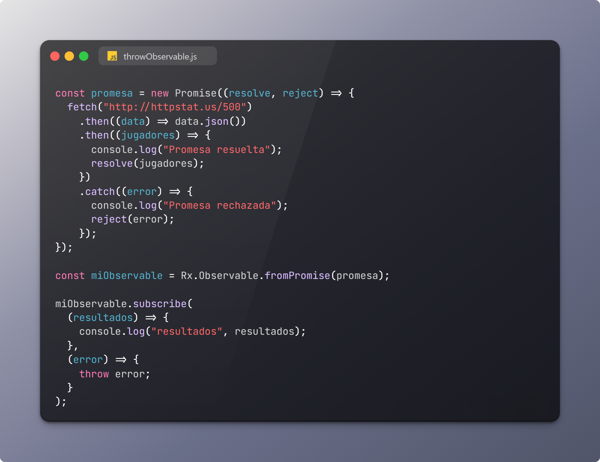
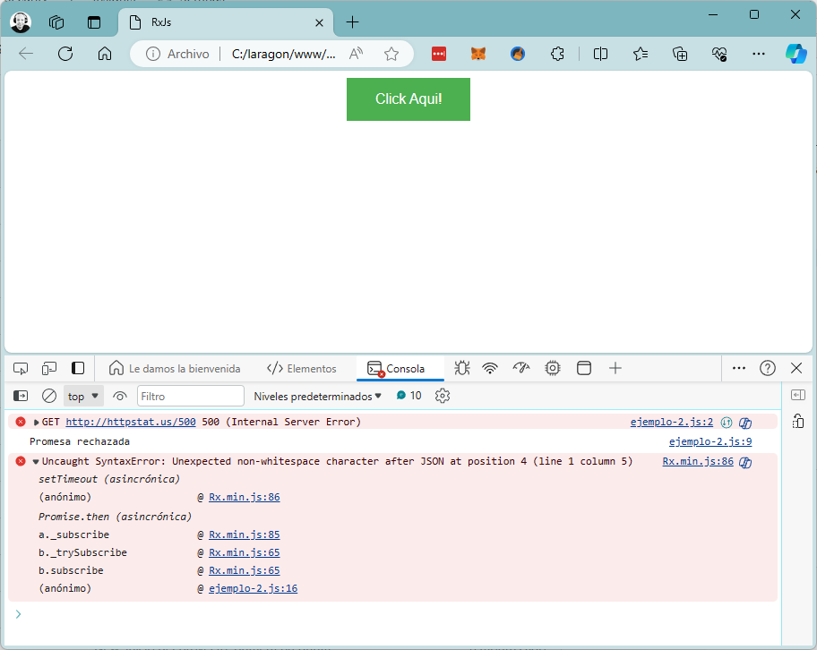

# Uso de throw

## Ejemplo 1

En el primer ejemplo se utiliza un concepto llamado generadores. Los generadores son funciones especiales que pueden pausar su ejecución y luego continuarla más tarde. Se definen con el símbolo * después de la palabra reservada function.

La función gen es un generador que entra en un bucle infinito. Dentro de este bucle, intenta producir (o "yield") el número 42. Si no ocurre ninguna excepción, seguirá produciendo 42 indefinidamente cada vez que se le pida un nuevo valor.

Sin embargo, si se lanza una excepción dentro del generador utilizando el método throw, el flujo de control se moverá al bloque catch. En este caso, se registra el mensaje "¡Error detectado!" en la consola.

La variable g es una instancia del generador. Cuando se llama al método next en g, el generador produce su primer valor, que es 42. Este valor se devuelve en un objeto con la forma { value: 42, done: false }, donde value es el valor producido y done es un booleano que indica si el generador ha terminado de producir valores.

Luego, se lanza una excepción en el generador utilizando el método throw. Esto causa que el generador capture la excepción y registre el mensaje "¡Error detectado!". A pesar de la excepción, el generador no se detiene y puede continuar produciendo valores. Por lo tanto, si se llama a g.next() de nuevo, se producirá otro 42.

## Ejemplo 2

Este segundo ejemplo utiliza la biblioteca RxJS para trabajar con observables y promesas.

Primero, se crea una nueva promesa que realiza una solicitud HTTP a la URL 'http://httpstat.us/500' utilizando la función fetch. Si la solicitud es exitosa, se intenta convertir la respuesta en JSON con data.json(). Luego, se imprime en la consola 'Promesa resuelta' y se resuelve la promesa con los datos JSON. Si ocurre algún error durante este proceso, se imprime en la consola 'Promesa rechazada' y se rechaza la promesa con el error.

Después, se crea un observable a partir de la promesa utilizando Rx.Observable.fromPromise(promesa). Un observable es un objeto que emite notificaciones (o eventos) a lo largo del tiempo. Puedes suscribirte a estos eventos utilizando el método subscribe.

Finalmente, se suscribe al observable. El método subscribe toma hasta tres argumentos: un manejador de éxito, un manejador de error y un manejador de finalización. En este caso, si el observable emite datos (es decir, si la promesa se resuelve con éxito), se imprime 'resultados' junto con los datos. Si el observable emite un error (es decir, si la promesa se rechaza), se lanza el error.

> Si consideras útil esta información, apóyalo haciendo "★ Star" en el repositorio. ¡Gracias 🙌!
